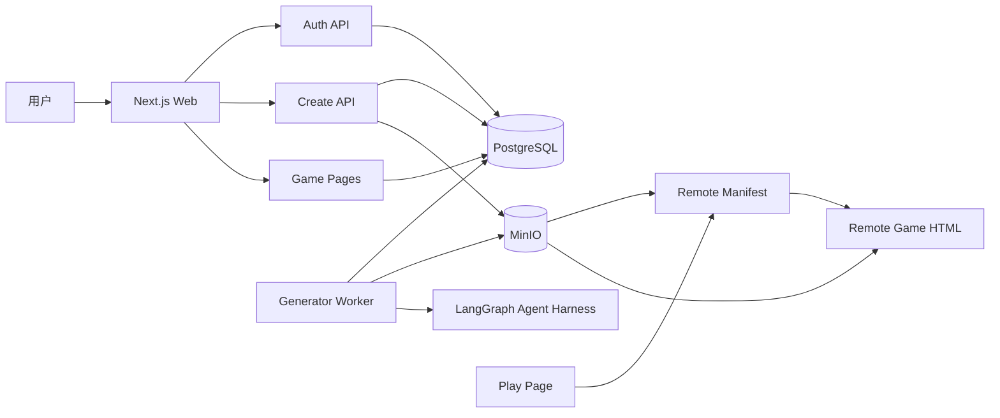

# 系统设计文档

## 目标

本项目是一个 AI Native 互动游戏 Web 平台 MVP，目标是在短周期内打通从用户登录、创意输入、异步生成、对象存储发布，到首页浏览和远端游玩的完整闭环。

核心链路：

```text
注册/登录 -> Create 输入创意 -> GenerationJob 入库 -> Worker 执行 Agent 流水线
-> 生成 HTML/Manifest/封面 -> 上传 MinIO -> Game meta 入库
-> Home 展示 -> Detail 查看 -> Play 动态加载远端游戏
```

## 技术栈

- 前端与后端：Next.js App Router、React、TypeScript
- 样式：Tailwind CSS
- 数据库：PostgreSQL
- ORM：Prisma
- 对象存储：MinIO，使用 S3 兼容协议
- 异步任务：Node.js Worker 轮询 `GenerationJob`
- Agent 编排：LangGraph `StateGraph`
- 游戏运行隔离：`iframe sandbox`

## 架构图



## 模块划分

### Web 页面

- `/`：首页，展示数据库中所有已发布游戏。
- `/register`：邮箱注册。
- `/login`：邮箱登录。
- `/create`：受保护的创作者页面，提交创意并查看生成任务历史。
- `/games/[slug]`：游戏详情页，展示版本历史和 Remix 入口。
- `/play/[id]`：动态加载远端 Manifest 并用 iframe 运行游戏。
- `/admin`：平台维护者后台，查看游戏、举报、任务和审计日志，支持下架/恢复内容。

### API

- `/api/auth/register`
- `/api/auth/login`
- `/api/auth/logout`
- `/api/generation-jobs`
- `/api/games/[id]/events`
- `/api/games/[id]/report`
- `/api/admin/games/[id]/status`
- `/api/admin/reports/[id]`

### Worker

`workers/generator/index.ts` 是异步生成进程。它轮询 `PENDING` 状态的任务，领取后执行 LangGraph `StateGraph`。图节点包括 `asset_analyzer -> planner -> coder -> reviewer -> publisher -> cost`，最终发布游戏产物。

### 对象存储

MinIO bucket 为 `ai-arcade`。主要路径：

```text
uploads/{userId}/{jobId}/{filename}
games/{jobId}/v{version}/index.html
games/{jobId}/v{version}/manifest.json
games/{jobId}/v{version}/cover.svg
```

## 数据模型

核心表：

- `User`：用户账号，保存邮箱、昵称和密码哈希。
- `Session`：登录会话，保存 session token hash 和过期时间。
- `Game`：游戏 meta，包括标题、简介、标签、作者、封面、Manifest URL、Bundle URL、发布状态。
- `GenerationJob`：生成任务，保存 prompt、状态、进度、输入文件、结果和错误信息。
- `GameVersion`：游戏版本，保存每个版本的 Manifest、Bundle、封面、对象存储路径和变更说明。
- `AgentLog`：Agent 执行日志。
- `UploadedAsset`：用户上传素材记录。
- `GameEvent`：游玩事件埋点。
- `GameReport`：用户举报记录，支持待处理、已处理、已驳回。
- `AdminAuditLog`：管理员操作审计，用于记录下架、恢复发布、举报处理等治理行为。
- `GameLike`：用户点赞记录。
- `GameFavorite`：用户收藏记录。
- `OAuthAccount`：第三方 OAuth 账号绑定记录。

`Game.parentGameId` 和 `Game.sourceVersionId` 用于记录 Remix 来源；`GenerationJob.parentGameId` 和 `GenerationJob.remixSourceVersionId` 用于追踪生成任务从哪个游戏版本派生。`GenerationJob` 还记录审核结果、估算 token 和估算成本。

## 远端产物协议

Play 页不直接运行本地组件，而是读取数据库中的 `manifestUrl`。服务端负责拉取和校验 Manifest，并写入 `PLAY_START`；客户端 iframe 实际加载完成、失败或超时时，再调用 `/api/games/[id]/events` 写入 `PLAY_LOADED` 或 `PLAY_ERROR`。Manifest 示例：

```json
{
  "schemaVersion": "1.0",
  "title": "AI 小游戏",
  "entry": "index.html",
  "entryUrl": "http://localhost:9000/ai-arcade/games/<jobId>/index.html",
  "bundleUrl": "http://localhost:9000/ai-arcade/games/<jobId>/index.html",
  "assets": [
    "http://localhost:9000/ai-arcade/games/<jobId>/cover.svg",
    "http://localhost:9000/ai-arcade/uploads/<userId>/<jobId>/<asset>"
  ],
  "permissions": ["keyboard", "pointer"],
  "createdByJobId": "<jobId>",
  "generatedAt": "2026-06-18T00:00:00.000Z"
}
```

## 当前 MVP 取舍

当前版本默认使用本地 fallback generator 生成 Canvas HTML 小游戏。Agent 流水线、任务调度、对象存储、数据库发布、远端加载链路都是真实的；配置 `OPENAI_API_KEY` 后，Planner/Coder 可以优先调用 OpenAI-compatible 模型 API，失败时自动回退。上传素材会先经过 `AssetAnalyzerAgent`，图片尽量解析尺寸并在 vision-capable Responses API 可用时生成视觉摘要，文本提取摘要，视频/音频记录元信息和对象存储 URL，再作为上下文传给 Planner/Coder。发布时上传素材 URL 会进入 Manifest `assets`，生成 HTML 可以直接把这些 MinIO URL 作为角色、道具、背景等运行时素材使用。

如果接入真实模型，可以替换 `PlannerAgent` 和 `CoderAgent` 内部实现，保留后续 Reviewer 和 Publisher 边界。

## 加分项实现

- Home 搜索、标签筛选和排序。
- 游戏点赞、收藏。
- 生成任务失败重试和自动刷新。
- Play 加载体验优化和客户端真实加载埋点。
- Google / GitHub OAuth 可配置接入，使用相同 `OAuthAccount` 模型绑定本地用户。
- OpenAI-compatible LLM 可选接入。
- Remix 派生和源版本追踪。
- `GameVersion` 版本管理。
- 生成成本估算。
- 轻量内容审核和资源限额。
- 管理后台：支持内容下架/恢复、举报处理、生成任务观察和管理员审计日志。
